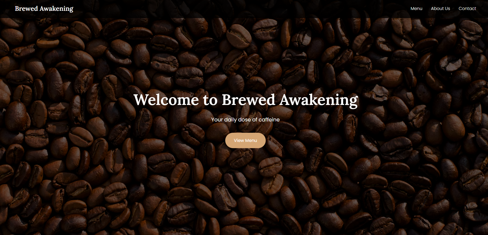

# Brewed Awakening Coffee Shop Website

A modern, responsive website for Brewed Awakening coffee shop, built with React, TypeScript, and Tailwind CSS. The website features a beautiful design with a warm color palette, smooth animations, and a fully responsive layout that works seamlessly across all devices.

## Features

- 🎨 Modern and clean design with warm coffee-inspired colors
- 📱 Fully responsive layout (mobile, tablet, desktop)
- 🖼️ Beautiful hero section with parallax effect
- 🍽️ Interactive menu cards with hover effects
- 📝 Contact form with validation
- 🎯 Smooth scroll navigation
- 🍔 Mobile-friendly hamburger menu
- 🎭 CSS animations and transitions

## Menu Highlights

Our carefully curated menu features premium coffee drinks and breakfast items:

### Coffee Selection

- **Espresso** - A strong and bold coffee experience
- **Latte** - Smooth espresso with steamed milk
- **Cappuccino** - A delightful mix of espresso, milk, and foam

### Breakfast Menu

## Technologies Used

- React 18
- TypeScript
- Tailwind CSS
- Lucide React Icons
- Vite
- Google Fonts (Lora, Poppins)
- Unsplash for high-quality images

## Project Structure

\`\`\`
brewed-awakening/
├── src/
│   ├── App.tsx           # Main React component
│   ├── index.css        # Global styles and Tailwind imports
│   └── main.tsx         # React entry point
├── public/              # Static assets
├── index.html          # HTML template
└── README.md           # Project documentation
\`\`\`

## Design Features

### Color Palette

- Primary: #4A3428 (Deep Brown)
- Secondary: #8B5E3C (Medium Brown)
- Accent: #D4A574 (Light Brown)
- Text: #333333 (Dark Gray)
- Background: #F5F5F5 (Light Gray)
- White: #FFFFFF

### Typography

- Headings: Lora (serif)
- Body: Poppins (sans-serif)

## Sections

1. **Header**
   - Navigation menu with Lucide React icons
   - Hero section with CTA
   - Responsive hamburger menu

2. **Menu**
   - Coffee drinks with images
   - Interactive cards with hover effects
   

3. **About Us**
   - Company information
   - Mission statement

4. **Contact**
   - Contact form with validation
   - Modern form design with focus states

5. **Footer**
   - Copyright information

## Responsive Design

The website is fully responsive and adapts to different screen sizes:

- Mobile: < 768px
- Tablet: 768px - 1024px
- Desktop: > 1024px

## Browser Support

- Chrome (latest)
- Firefox (latest)
- Safari (latest)
- Edge (latest)

## Best Practices

- TypeScript for type safety
- Semantic HTML5 elements
- Tailwind CSS for styling
- Mobile-first approach
- Optimized images
- Accessible form elements

## Performance Considerations

- Vite for fast development and optimized builds
- Optimized image loading
- Minimal CSS with Tailwind's purge
- React component optimization
- Hardware-accelerated animations

## Future Enhancements

- Add online ordering system
- Implement loyalty program
- Add blog section
- Include customer reviews
- Add image gallery
- Integrate with social media
- Add menu item filtering
- Implement dark mode

## License

This project is licensed under the MIT License - see the LICENSE file for details.

## Credits

- Images: [Unsplash](https://unsplash.com)
- Fonts: [Google Fonts](https://fonts.google.com)
- Icons: [Lucide React](https://lucide.dev)
